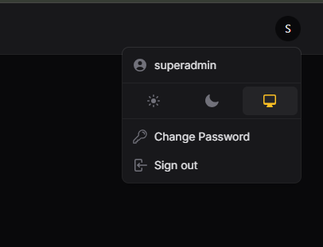
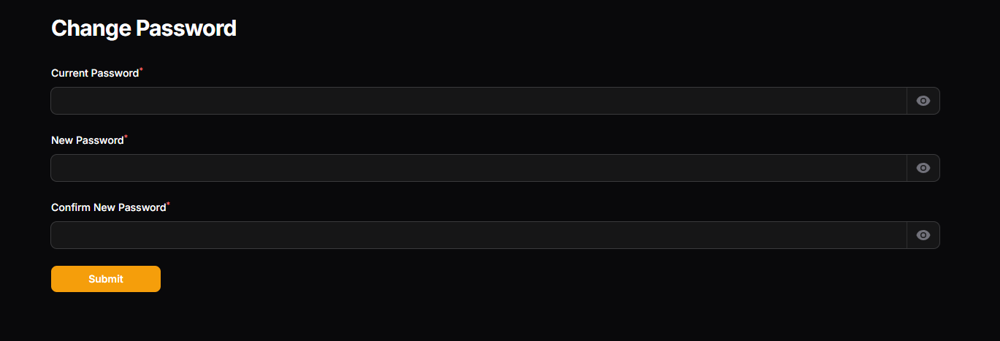

# Filament Change Password Page Plugin

A simple and customizable filament plugin that provides a standalone **Change Password** page for your laravel filament admin panel.

## 🔗 GitHub Repository

[https://github.com/HardikKhorasiya09/change-password](https://github.com/HardikKhorasiya09/change-password)

---

## 🚀 Features

- Adds a dedicated **Change Password** page to your filament panel.
- Clean, user-friendly UI.
- Easily extendable and customizable.
- Secure password update logic.

---

## 🛠 Installation and Setup

You can install this plugin via **Composer**.

### Step 1: Install the Plugin

Run the following command to install the package via Composer:

```bash
composer require hardikkhorasiya09/change-password
```

### Step 2: Add this into your Filament `PanelProvider` class `panel()`

```php
use Hardikkhorasiya09\ChangePassword\ChangePasswordPlugin;

$panel->...
    ->plugins([
      ...
      ChangePasswordPlugin::make()      //required to enable this extension
    ]); 
```

## ⚙️ Step 3: (Optional) Restrict Page Access by User

If you want to restrict access to the **Change Password** page for specific users, you can define a `canAccessChangePassword()` method in your `User` model.

```php
// In app/Models/User.php

public function canAccessChangePassword(): bool
{
    // Example: Only allow users with 'admin' role
    return $this->role === 'admin';
}
```

---

## 🔐 Usage
Once installed and registered, a new Change Password page will appear in the user menu (or wherever you've configured it). Users can securely change their current password using this interface.

## 📷 Screenshot



